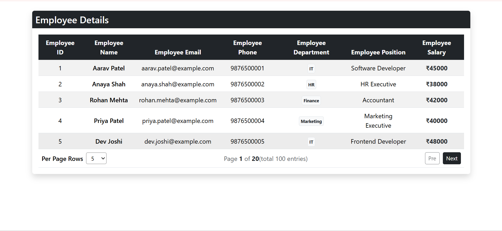

# Employee Details App

This project fetches employee data from a JSON Server API and displays it in a responsive table with pagination.

## Features

* Display employee details in a table
* Fetch data using REST API
* JSON Server integration
* Pagination support
* Select rows per page
* Previous and Next page buttons
* Responsive table design

## Technologies Used

* React JS
* JavaScript
* Bootstrap 5
* JSON Server
* REST API
* HTML
* CSS

## Pagination

The application provides pagination to display employee records in different page sizes.

Available options:

* 5 rows
* 10 rows
* 25 rows
* 50 rows
* 75 rows
* 100 rows

The user can navigate using:

* **Pre** button
* **Next** button

## 📂 Project Structure

📂 db-server/
- 📁 public/
- 📁 src/
    - 📄 App.jsx
    - 📄 main.jsx
- 🗄️ db.json
- 📄 index.html
- 📦 package.json
- 🔒 package-lock.json
- 📖 README.md

## 📷 Screenshots

## 🔗 Video Link

https://drive.google.com/file/d/1e26GiRSdoIfXqi2MFPI0UCHfkNBaCLTV/view?usp=sharing
