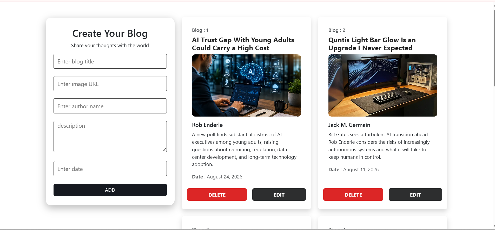

# 📝 Blog CRUD App

A simple Blog Management CRUD Application built using React JS and JSON Server.

## ✨ Features
- 📖 Display all blogs
- ➕ Add new blog
- ✏️ Edit existing blog
- 🗑️ Delete blog
- 🖼️ Add blog image using image URL
- 👤 Author information
- 📅 Blog date
- 💾 Data stored using JSON Server REST API

## 🛠️ Technologies Used
- JavaScript
- React JS
- CSS
- Bootstrap
- JSON Server
- REST API

## 📂 Project Structure

📂 db-server/
- 📁 public/
- 📁 src/
    - 📄 App.jsx
    - 🎨 App.css
    - 📄 main.jsx
- 🗄️ db.json
- 📄 index.html
- 📦 package.json
- 🔒 package-lock.json
- 📖 README.md

## 📋 Blog Fields
- Title
- Image
- Author
- Description
- Date
- ID

## ⚙️ CRUD Operations
- Create

   - Add a new blog by entering the title, image URL, author, description, and date.

- Read

    - All blogs are fetched from the JSON Server API and displayed as cards.

- Update

    - Click the EDIT button to load the selected blog data into the form and update it.

- Delete

    - Click the DELETE button to remove a blog from the JSON Server.

## 🔗 API Endpoint

The application uses the following REST API:

- http://localhost:3000/blogs

## API Methods
- GET     → Fetch all blogs
- POST    → Add a new blog
- PUT     → Update an existing blog
- DELETE  → Delete a blog

## 📷 Screensort

## 🔗 Video Link

https://drive.google.com/file/d/10B-46xK2pXTbBcHmqyvp8x7II41U5pOV/view?usp=sharing