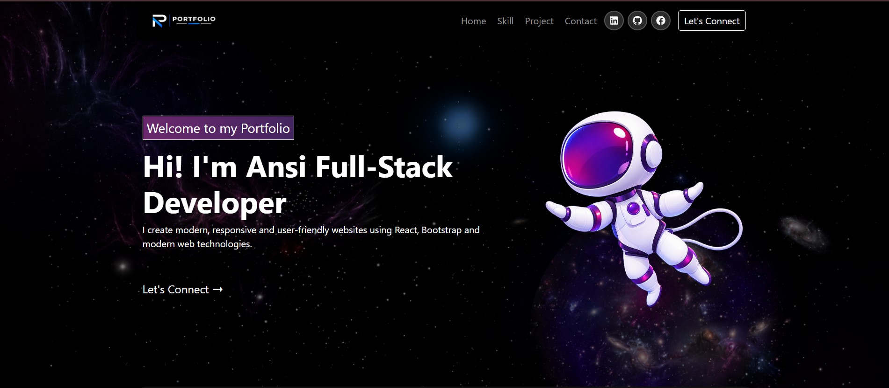
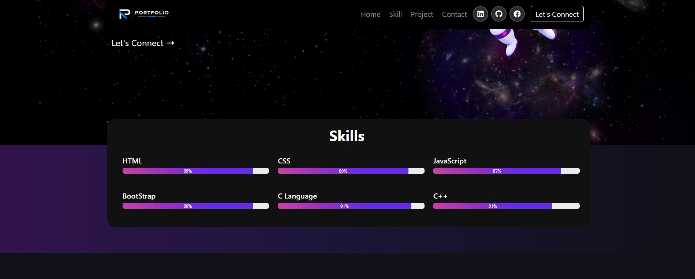
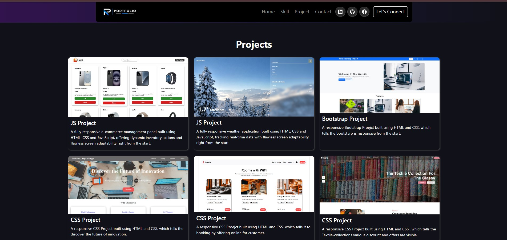
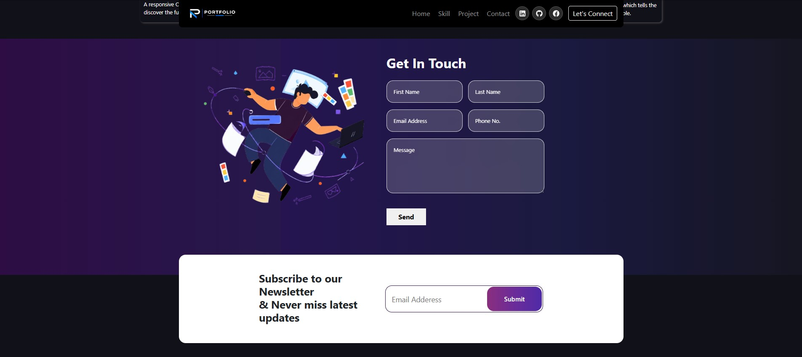

# 🌐 Personal Portfolio Website

A modern and responsive Personal Portfolio Website built using React.js, Bootstrap, CSS, and React Icons.
This portfolio showcases my skills, projects, and provides a contact section for visitors to get in touch.

## 🚀 Features

- 🏠 Home Section – Introduction and portfolio welcome message
- 💻 Skills Section – Displays technical skills with progress bars
- 📂 Projects Section – Showcases different web development projects
- 📞 Contact Section – Contact form with name, email, phone and message fields
- 📧 Newsletter Section – Email subscription area
- 🔗 Social Media Icons – LinkedIn, GitHub and Facebook
- 🎨 Modern Dark UI – Clean and professional portfolio design

## 🛠️ Technologies Used

- React.js
- JavaScript
- HTML5
- CSS3
- Bootstrap
- React Icons

## 📚 Skills

- HTML – 89%
- CSS – 89%
- JavaScript – 87%
- Bootstrap – 89%
- C Language – 91%
- C++ – 81%

## 📂 Projects

1. 🛒 Product Management System
   - A responsive e-commerce management panel built using HTML, CSS and JavaScript.
   - It provides dynamic inventory management features and responsive screen adaptability.

2. 🌦️ Weather Application
   - A responsive weather application built using HTML, CSS and JavaScript.
   - It displays real-time weather information and provides a user-friendly interface.

3. 🎨 Bootstrap Project
   - A responsive website created using HTML, CSS and Bootstrap, demonstrating responsive web
   - design principles.

4. 💡 CSS Project
   - A responsive website built using HTML and CSS, focusing on modern design and innovation.

5. 🏠 Rental Project
   - A responsive rental/booking website designed using HTML and CSS for an easy-to-use customer interface.

6. 👕 Fabric Project
   - A responsive textile collection website created using HTML and CSS, showcasing textile products, discounts and offers.

## 📁 Project Structure

- 📂Portfolio/
- 📁 public/
- 📁 src/
    - 📁 assets/
        - 🖼️ logo.png
    - 📄 App.jsx
    - 🎨 App.css
    - 📄 main.jsx
- 📄 index.html
- 📦 package.json
- 🔒 package-lock.json
- 📖 README.md

## 📸 Screenshots

## 🔗 Video Link

https://drive.google.com/file/d/1m-06vPQ0uW1BDbHztlP6UO_4Y0Xj0Cv-/view?usp=sharing