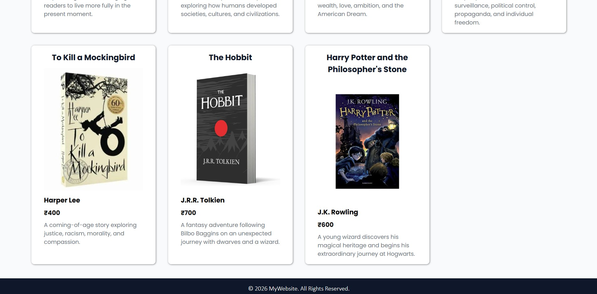

# 📚 Book Collection

A simple and professional **Book Collection Website** built using **React.js**.
This project displays a collection of books with their title, author, price, cover image, and description.

## 🚀 Features

- 📖 Display multiple books
- 🖼️ Book cover images
- ✍️ Author information
- 💰 Book prices
- 📝 Book descriptions
- 🧩 Reusable React components
- 📱 Simple and clean user interface
- 🔗 Data passed using React Props

## 🛠️ Technologies Used

- React.js
- JavaScript (ES6)
- JSX
- CSS
- HTML
- Vite

## 📂 Project Structure

📚 Book-Collection/
- 📁 public/
- 📁 src/
    - 📁 assets/
        - 🖼️ logo.png
    - 📁 components/
        - 📄 Header.jsx
        - 📄 Home.jsx
        - 📄 Footer.jsx
    - 📁 style/
        - 🎨 Home.css

    - 📄 App.jsx
    - 🎨 App.css
    - 📄 main.jsx

- 📄 index.html
- 📦 package.json
- 🔒 package-lock.json
- 📖 README.md

## 🧩 Components

### Header

The Header component contains:

- Website logo
- Home menu
- About menu
- Contact Us menu
- Service menu

### Home

The Home component receives book data using **Props**.

<!-- ```jsx
<Home mydata={books} />
``` -->

The `map()` method is used to display every book dynamically.

Each book contains:

- Book name
- Image
- Author
- Price
- Description

### Footer

The Footer component displays the copyright information at the bottom of the website.

## 💡 React Concepts Used

This project demonstrates the following React concepts:

- Components
- JSX
- Props
- Arrays
- `map()` method
- Inline Styling
- CSS
- Import and Export

## 📷 Screensort




## 🔗 Video Link

https://drive.google.com/file/d/1GR7ER_L4JYZtXNM-AGS5UeG4XJa_Tblh/view?usp=sharing